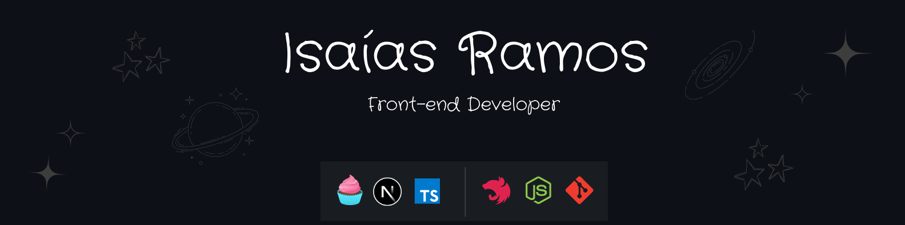

 

## 👋🏻 About me

Hello, I'm Isaías Ramos, a Software Engineering graduate with an interest in technology and software development.
 
 
In recent months, I have dedicated myself to studying programming and software development, taking online courses and practicing on personal projects. My goal is to acquire solid knowledge in programming and be able to contribute to the development of efficient and creative solutions.
 
  
I am a determined, organized person with problem-solving skills. I believe that these skills can be applied in the area of ​​software development to contribute significantly to the team.

 - 💼 Focused on learning the main technologies on the market.
 - ✏️ Currently studying AWS and Docker. 
 - 📕 Love for fiction books.

 

## 🎓 Skills

<h3>Back-end</h3>

<h3>Front-end</h3>

 

## ✉️ Contacts

    
    
    

 

## 📈 Languages and GitHub Stats

  <a href="https://github.com/isaiasramosdeoliveira">
  
  

